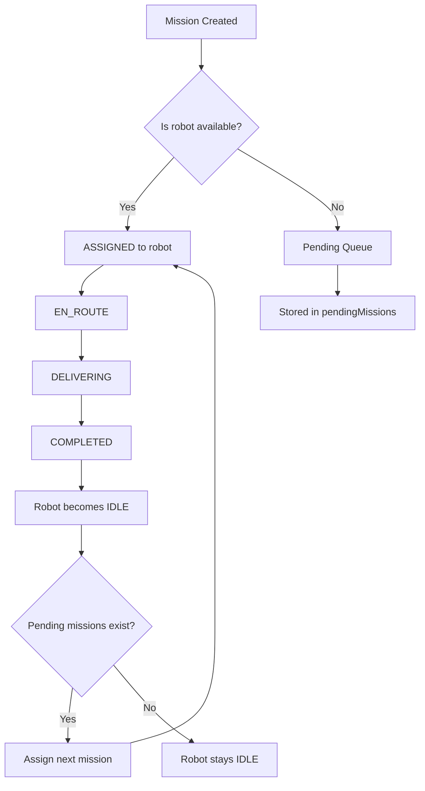
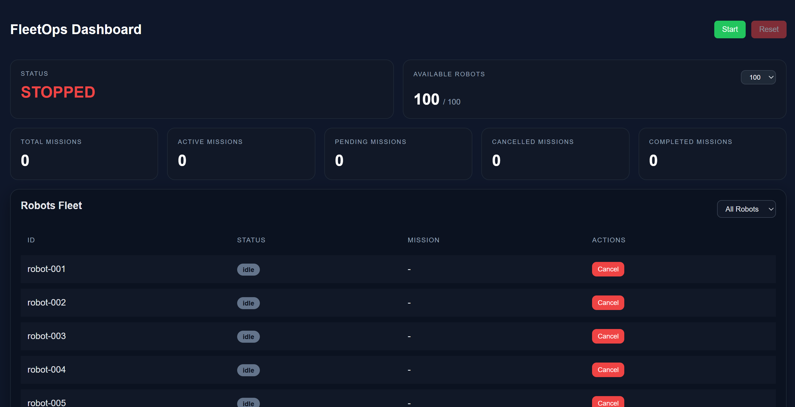

# FleetOps Simulation System

## Table of Contents

1. [Overview](#overview)
2. [Project Structures](#project-structure)
3. [Setup Instructions](#setup-instructions)
4. [API Endpoints](#api-endpoints)
5. [System Architecture](#system-architecture)
6. [Simulation Logic](#simulation-logic)
7. [Mission Lifecycle](#mission-lifecycle)
8. [State Machine & Scheduling Flow](#state-machine--scheduling-flow)
   - [Timing Model](#timing-model)
   - [Mission Assignment Flow](#mission-assignment-flow)
   - [Pending Queue](#pending-queue)
   - [Cancellation Flow](#cancellation-flow)
   - [System State Model](#system-state-model)
   - [System Statistics](#system-statistics)
9. [Design Decisions](#design-decisions)
10. [Scalability Considerations](#scalability-considerations)
11. [Frontend Dashboard](#frontend-dashboard)
12. [AWS Architecture (Theoretical Design)](#aws-architecture-theoretical-design)
13. [Future Enhancements](#future-enhancements)
---

## Overview

FleetOps is a real-time in-memory robotics simulation system that models autonomous fleet behavior, mission assignment, and lifecycle execution.

The system simulates:

- 100+ autonomous robots
- Continuous mission generation
- Real-time state transitions per robot
- Pending queue handling
- Mission cancellation and recovery flows

It runs entirely in Node.js using timers and in-memory state without persistence.

---

## Project Structure

The project is split into two main parts:

- backend (Node.js + TypeScript simulation engine)
- frontend (React dashboard UI)

### Backend Structure

```bash
src/
- config/        # Simulation configuration (fleet size, timings)
- controllers/   # HTTP route handlers
- services/      # Core simulation logic (robots, missions, lifecycle)
- routes/        # API route definitions
- data/          # In-memory stores (robots, missions, queues)
- types/         # TypeScript interfaces
- utils/         # Logger and helpers
- bootstrap.ts   # System initialization
```

### Frontend Structure

```bash
src/
- api/           # API clients for backend communication
- components/    # UI components (tables, cards, etc.)
- types/         # TypeScript interfaces
- App.tsx        # Main dashboard logic
```

---

## Setup Instructions

### Requirements

- Node.js 18+
- npm (or yarn)

### Installation

Install dependencies for both applications.

#### Backend

```bash
cd backend
npm install
```

#### Frontend

```bash
cd frontend
npm install
```

### Running the Application

Start the backend server:

```bash
cd backend
npm run dev
```

Backend API:

```text
http://localhost:3001
```

Start the frontend application in a separate terminal:

```bash
cd frontend
npm run dev
```

Frontend UI:

```text
http://localhost:5173
```

### Notes

- The backend must be running before starting a simulation.
- The frontend communicates with the backend through the REST API.
- Both applications should be running simultaneously during development.

---

## API Endpoints

### Simulation

| Method | Endpoint            | Description               |
| ------ | ------------------- | ------------------------- |
| POST   | `/simulation/start` | Starts mission generation |
| POST   | `/simulation/reset` | Resets system state       |

### Data

| Method | Endpoint  | Description               |
| ------ | --------- | ------------------------- |
| GET    | `/robots` | Returns all robots        |
| GET    | `/system` | Returns system statistics |

### Robot Control

| Method | Endpoint               | Description                          |
| ------ | ---------------------- | ------------------------------------ |
| GET    | `/robots/:id`          | Returns a single robot by ID         |
| POST   | `/robots/:id/cancel`   | Cancels current mission for a robot  |

---

## System Architecture

```
Controllers → Services → In-Memory Store
```

Core services:

* SimulationService → mission orchestration
* RobotLifecycleService → robot state machine
* MissionService → mission creation
* RobotService → fleet initialization

---

## Simulation Logic

Each robot operates as an independent state machine with its own lifecycle timers and timestamps.

---

## Mission Lifecycle

```
IDLE → ASSIGNED → EN_ROUTE → DELIVERING → COMPLETED → IDLE
```

Transitions are time-based using randomized delays per state, defined in the simulation configuration.

### States

**IDLE**
Robot is available for assignment.

**ASSIGNED**
Mission is assigned to robot and lifecycle starts.

**EN_ROUTE**
Robot is traveling to destination (simulated delay).

**DELIVERING**
Robot is executing mission.

**COMPLETED**
Mission is finished successfully.

Robot then returns to IDLE.


## State Machine & Scheduling Flow

The system includes a hybrid model of:
- State machine per robot
- Global mission queue (pending missions)


---

### Timing Model

Each state transition uses:

* Randomized durations per stage
* Config-based timing ranges
* `Date.now()` timestamps per state

This simulates real-world asynchronous behavior.

---

### Mission Assignment Flow

```
Mission Generated
      │
      ▼
Check available robots
      │
      ├── Available → assign immediately
      └── None → push to pending queue
```

---

### Pending Queue

* FIFO queue
* Stores unassigned missions
* Automatically consumed when robot becomes available

---

### Cancellation Flow

```
Active Mission
      │
      ▼
Cancel triggered
      │
      ▼
Robot → IDLE
      │
      ▼
Robot becomes available
      │
      ▼
Pending queue checked automatically
```

---

### System State Model

Each robot contains:

* status
* startedAt
* durationMs
* missionId

---

### System Statistics

* totalRobots
* availableRobots
* activeMissions
* pendingMissions
* completedMissions
* cancelledMissions
* totalMissions

---

## Design Decisions

### In-Memory Architecture

All system state is stored in memory for simplicity and speed.

Tradeoff: no persistence across restarts.

---

### Event-Driven Simulation

The system uses:

* `setInterval` for mission generation
* `setTimeout` for lifecycle transitions

---

### Single Source of Truth

All missions are created via `MissionService` to ensure consistency.

---

## Scalability Considerations

Current limitations:

* In-memory only
* Single-process execution
* No persistence layer
* No distributed workers

Suitable for:

* simulations
* dashboards
* demos
* educational systems

---

## Frontend Dashboard

The frontend provides a real-time control panel for the simulation.

### Main Features

- Start / Reset simulation controls
- Fleet size selector (5 / 10 / 20 / 50 / 80 / 100 robots)
- Live system statistics:
  - Total / Active / Pending / Cancelled / Completed missions
  - Available vs Busy robots
- Robot table with real-time updates
- Status filtering (idle, en_route, delivering, etc.)

### Dashboard Preview



### UI Design Philosophy

The UI is designed to reflect the backend simulation state in real time.
It acts as a live visualization layer over an event-driven backend system.

The dashboard separates:

- System controls (start/reset)
- High-level metrics (system state, robots, fleet size selection, missions)
- Detailed robot-level inspection (filterable table)

---

## AWS Architecture (Theoretical Design)

This section describes a high-level cloud architecture design for deploying the FleetOps simulation system in AWS.

> Note: This is a theoretical design only. No actual deployment has been implemented.

---

### Overview

The system is split into two main parts:

- Frontend: React-based dashboard for real-time visualization
- Backend: Node.js simulation engine managing robots and missions

The goal is to deploy a scalable, production-ready architecture using AWS managed services.

---

### AWS Services Breakdown

#### 1. Frontend Hosting

- Amazon S3 (Static Website Hosting)
- Amazon CloudFront (CDN)

**Reasoning:**
The React application is a static build. It is stored in an S3 bucket and served globally using CloudFront for low latency and caching.

---

#### 2. Backend Deployment

- Amazon ECS (Elastic Container Service)
- AWS Fargate (serverless container runtime)
- Application Load Balancer (ALB)

**Reasoning:**
The backend runs as a Docker container. ECS with Fargate is preferred over EKS for simplicity and reduced operational overhead.

The ALB routes incoming HTTP traffic (port 80/443) to backend containers.

---

#### 3. Networking

- Application Load Balancer (ALB)

**Reasoning:**
Handles routing between frontend API requests and backend services. Enables scaling and health checks.

---

#### 4. Database Layer (Future Extension)

- Amazon RDS (PostgreSQL)
- AWS Secrets Manager

**Reasoning:**
Although the current system uses in-memory storage, a production version would require persistence:

- RDS stores robots, missions, and system state
- Secrets Manager securely stores DB credentials

---

#### 5. CI/CD Pipeline

- GitHub Actions
- Amazon ECR (Elastic Container Registry)
- ECS Deployment via task updates

**Flow:**

1. Backend:
   - Build Docker image
   - Push to Amazon ECR
   - Deploy new ECS task via GitHub Actions

2. Frontend:
   - Build React app
   - Upload build artifacts to S3
   - Invalidate CloudFront cache

---

#### 6. Environments

- Separate AWS accounts or environments:
  - Development
  - Production

**Reasoning:**
Isolation between environments ensures safety, stability, and controlled deployments.

---

### High-Level Communication Flow

```bash
Client (React)
↓
CloudFront
↓
S3 (static files)

Client API calls
↓
API Gateway / ALB
↓
ECS Backend (Node.js)
↓
(Optional) RDS Database
```


---

### Key Architectural Decisions

### ECS over EKS
ECS was chosen instead of Kubernetes (EKS) because:
- Lower complexity
- No need for orchestration overhead
- Suitable for a single backend service

---

#### Stateless Backend Design
The backend is designed to be stateless in AWS:
- Simulation state can be moved to RDS or in-memory per container
- Horizontal scaling is possible using multiple ECS tasks

---

#### Scalability Considerations
- CloudFront handles global frontend scaling
- ECS allows backend horizontal scaling
- ALB distributes load between containers

---

### Optional Improvements (Future Work)

- Add Redis (ElastiCache) for real-time queue management
- Use WebSockets (API Gateway or ALB) for live robot updates
- Add observability with CloudWatch + X-Ray

---

## Future Enhancements

* WebSocket real-time updates
* Persistent database for missions
* Allow operators to modify runtime settings directly from the dashboard
* Retry/failure handling
* Deterministic Simulation via Seeding - Introduce a seed-based random generator to allow reproducible simulation runs for testing, debugging, and performance evaluation.
* Enhanced State Observability - Extend robot state models with real-time progress tracking (e.g., remaining time per state), enabling a more transparent and real-time operational dashboard experience.

